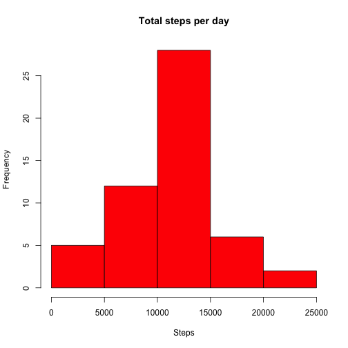

## Loading and preprocessing the data


First we have to unzip the data, we will use the function unz and then we read the CSV file:


```r
zipfile="activity.zip" 
file="activity.csv"
activity <- read.csv(unz(zipfile, file), sep=",", header=TRUE, stringsAsFactors=FALSE)
```


cheking the names of the columns, it is found that the data has the following: steps, date, interval. With the names we will evaluate the class of the columns in order to know if is necesarry some transformation on the variables:

```r
class(activity$steps)
```

```
## [1] "integer"
```

```r
class(activity$date)
```

```
## [1] "character"
```

```r
class(activity$interval)
```

```
## [1] "integer"
```

As you see the column *date*  is factor, in fact this is a date, so, we could transform to a date, but for now we will let it as factor.

## What is mean total number of steps taken per day?

In this point is useful use the function *aggregate* , we will take account the *N.A* to know in which date there is no data, also the column of the stpes is renamed to **TotalStepsDay**


```r
total<-aggregate(steps ~ date, data = activity, sum,na.action=na.pass)
colnames(total)[2] <- "Total"
```

Below you will find the histogram for the total steps.

```r
hist(total$Total, col="red", main="Total steps per day", xlab="Steps")
```

 


## What is the average daily activity pattern?


## Imputing missing values


## Are there differences in activity patterns between weekdays and weekends?
